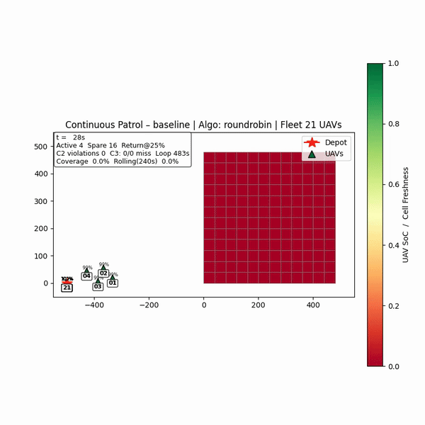

# Persistent UAV Surveillance

Simulation framework for continuous UAV-swarm surveillance of a rectangular
area, with battery-aware swap logistics, distance-aware return-to-base, and
single-failure handling. Built as an MSc thesis at Cranfield University.



> 240 s of `sim_020` (steady-state baseline, N=21) shown at 20× speed. Greener
> cells have been observed more recently; UAVs are coloured by state-of-charge
> from green to red.
>
> **Full-quality run videos** for all five canonical runs
> (sim_020/023/024/025/026, ≈52–108 MB each) are attached to the
> [v1.0 release](../../releases/tag/v1.0).

## What this is

A small, modular, solver-agnostic baseline for persistent surveillance
missions. The area is discretised into Δ=40 m cells; the revisit-time gap
between observations is the core metric. A staged pipeline checks battery
feasibility, sizes the fleet, generates routes that fit a single battery
window, schedules staggered launches to avoid single-pad conflicts, and runs
the resulting plan in a 1 Hz simulator with auditable per-tick logs.

The framework sustains mid-80s coverage on the baseline geometry, behaves as
expected under under- and over-provisioning, holds the same envelope over a
long horizon (9600 s), and absorbs a single-UAV failure without materially
changing mission-level performance. See [RESULTS.md](RESULTS.md) for the
headline numbers and [docs/architecture.md](docs/architecture.md) for the
pipeline and 1 Hz tick order.

## Architecture

```
┌─────────────────────────────────────────────────────┐
│ Design-time stages                                  │
│ ┌──────┐ ┌──────┐ ┌──────┐ ┌──────┐ ┌──────────┐    │
│ │ 0    │→│ 1    │→│ 2    │→│ 3A   │→│ 3B       │    │
│ │ Bat  │ │ Grid │ │Fleet │ │Route │ │Schedule  │    │
│ │ LP   │ │      │ │ size │ │ R-R  │ │  pack    │    │
│ └──────┘ └──────┘ └──────┘ └──────┘ └──────────┘    │
└───────────────────────────────┬─────────────────────┘
                                ↓
                ┌───────────────────────────────┐
                │ 1 Hz Ground-Station Scheduler │
                │  · Stage 4 dispatch policy    │
                │  · Stage 5 failure handling   │
                │  · Stage 6 V&V monitors       │
                └───────────────────────────────┘
```

| Stage | Purpose |
|---|---|
| **0** | Battery feasibility (linear inequality / LP) |
| **1** | Rectangular grid discretisation |
| **2** | Fleet split: active + rotation spares + contingency |
| **3A** | Route generation (Round-Robin baseline; ALNS, KMNN evaluated) |
| **3B** | Schedule packing (batch + intra-batch stagger) |
| **4** | Dispatch policy: distance-aware RTB, ETA pre-launch, tail-extension |
| **5** | Failure quick-patch: bridging + contingency takeover + promotion |
| **6** | V&V: CSV metrics, coverage / violations / fleet / SoC / percentile plots |

## Baseline parameters

| Parameter | Value | Note |
|---|---|---|
| Area | 500 × 500 m | Square |
| Cell size Δ | 40 m | 12 × 12 grid |
| Cruise speed v | 4 m/s | |
| Battery endurance B | 2100 s | 35 min usable |
| SoC floor σ_min | 10 % | |
| Depot offset | 500 m | Single ground station |
| Revisit cap Θ | 180 s | Analysis bound |

Full configurations live in [configs/](configs/) (`baseline_v2.json`,
`urban_v2.json`, `rural_v2.json`, `performance_test_v2.json`,
`battery_study_v2.json`, `test_v2.json`).

## Quick start

```bash
# Python 3.11+ (tested on 3.11 and 3.12)
python -m venv .venv && source .venv/bin/activate
pip install -r requirements.txt

# Tests
pytest uav_surveil/tests/ -v

# Programmatic battery-feasibility check
python - <<'PY'
from uav_surveil.config import load_scenario
from uav_surveil.stage0_battery import optimize_battery_from_config

cfg = load_scenario("baseline")
result = optimize_battery_from_config(cfg, l_grid=2000.0)
print(f"feasible: {result.is_feasible}, reserve: {result.xi_optimal:.1%}")
PY

# Run the visualiser (produces MP4/CSV under results/)
python examples/visualize_simulation.py
```

## Results

| Run | Description | Avg cov. % | Peak % | Time ≥ 90% (s) |
|---|---|---:|---:|---:|
| `sim_020` | Steady-state baseline (N=21) | 85.2 | 99.3 | 2282 |
| `sim_024` | Under-provisioned (N=11)     | 67.6 | 85.4 | 0    |
| `sim_025` | Over-provisioned (N=31)      | 88.5 | 99.3 | 3485 |
| `sim_026` | Long-run (N=21, 9600 s)      | 84.3 | 99.3 | 2610 |
| `sim_023` | Single-UAV failure @1800 s   | 84.9 | 99.3 | 2233 |

Full per-run figures live in [figures/](figures/), CSVs in [results/](results/),
zipped per-run packs in [sim_packs/](sim_packs/). See [RESULTS.md](RESULTS.md)
for the failure delta table and takeaways.

## Repository layout

```
configs/         Six predefined scenario JSONs
docs/            Architecture, build timeline, baseline-config notes
examples/        Visualiser entry point and Stage-6 plotting scripts
figures/         Canonical figures (sim_020/023/024/025/026 + comparisons)
results/         Per-tick CSV metrics for the five canonical runs
sim_packs/       Zipped per-run artefact bundles + index.json
tools/           make_sim_packs.py, compare_metrics.py
uav_surveil/     Python package
  core/          UAV, Cell, Route data models (Pydantic)
  gss/           Ground-Station Scheduler (1 Hz orchestrator)
  config/        Configuration system + 6 scenarios
  tests/         pytest suite
  stage0_battery.py … stage5_failure.py
```

## Tech stack

Python 3.11+, NumPy, Pandas, Matplotlib, Pydantic, Pyomo, SimPy, NetworkX,
pytest. Full pinned versions in `requirements.txt`.

## Publication

This work was presented at **ICRITA 2025** (International Conference on Recent
Innovations and Trends in Aerospace). The full paper is forthcoming in
**Springer Lecture Notes in Networks and Systems (LNNS)**; citation details
will be added here once the proceedings are published.

## Scope and limitations

The baseline is intentionally narrow and auditable: single fixed depot,
uniform rectangular grid, identical airframes, 2-D pass-over sensing at
constant altitude, linear SoC model with a fixed swap/service time, single
active failure, no wind, no obstacles or no-fly zones, and a centralised 1 Hz
scheduler with perfect state and reliable links. Each stage is small and
swappable; the natural extensions (Latin-Hypercube parameter sweeps,
overlapping failures, adaptive spare floor, balanced-VRP/ALNS routing,
wind-aware energy model, 3-D / DEM / no-fly zones, multi-depot logistics,
Monte-Carlo robustness with STL ρ(t)) are discussed in Chapter 5 of the
thesis.

## Author

Abhirva Navalakhe — MSc Autonomous Vehicle Dynamics & Control, Cranfield
University, 2024–25.

Supervisors: Dr. Sabyasachi Mondal and Dr. Venkatraman Renganathan.

## License

Apache License 2.0. See [LICENSE](LICENSE) and [NOTICE](NOTICE).
